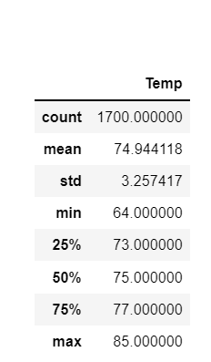
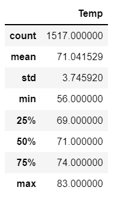

# surfs_up
Analysis of climate data.

## Overview of Analysis
The purpose of this analysis was to gather recorded temperatures on the island of Oahu for the months of June and December in the years 2010-2017. Once the information was gathered, a basic statistical summary was done to compare temperatures in the selected months. (see results). This analysis comes after a broader analysis of weather on the island in order to determine if it is a good location for W. Avy's ice cream and surf shop.

## Results
View the results of the statistical summary for each month here:
 JUNE 
</img>
 DECEMBER 
 </img> 